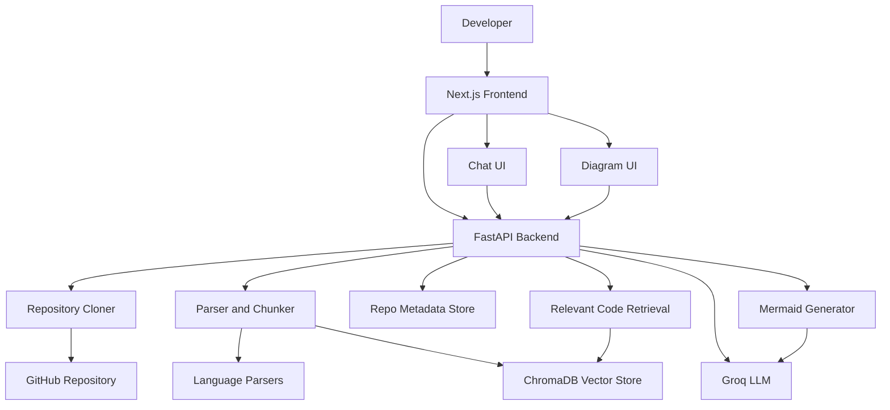

# CodeAtlas

<p align="center">
  <strong>AI-powered repository intelligence for understanding unfamiliar codebases fast.</strong>
</p>

<p align="center">
  <a href="#quickstart">Quickstart</a> |
  <a href="#features">Features</a> |
  <a href="#architecture">Architecture</a> |
  <a href="#api-reference">API</a> |
  <a href="#roadmap">Roadmap</a>
</p>

<p align="center">
  
  
  
  
  
</p>

CodeAtlas turns any public GitHub repository into an explorable knowledge base.
Paste a repo URL, wait for analysis, then inspect the file tree, language
breakdown, architecture diagrams, and ask code-aware questions with source
citations.

It is built for developers who need to onboard onto a project quickly, review
an unfamiliar codebase, or explain architecture without manually reading every
file first.

## What It Does

```text
GitHub URL -> Clone -> Parse -> Chunk -> Embed -> Explore -> Chat -> Diagram
```

CodeAtlas analyzes a repository locally, indexes meaningful source chunks, and
uses retrieval-augmented generation to answer questions against the indexed
code. It also generates Mermaid diagrams for architecture-oriented views.

## Features

- Public GitHub repository analysis with shallow cloning and size validation.
- Multi-language parsing for Python, JavaScript, TypeScript, Java, Go, Rust, C, C++, and common config/docs files.
- AST-based Python parsing and regex-based extraction for other supported languages.
- ChromaDB vector storage for semantic retrieval over repository chunks.
- AI chat with streamed responses and source citations.
- Mermaid diagram generation for class, dependency, flow, and architecture views.
- Repository dashboard with file explorer, language stats, and generated diagrams.
- Persistent repository metadata so analyzed projects survive backend restarts.
- Safe development server that ignores generated folders during hot reload.

## Product Flow

1. Enter a public GitHub repository URL.
2. Backend validates the URL and checks GitHub metadata.
3. Repository is cloned into a local runtime folder.
4. Supported files are parsed into semantic chunks.
5. Chunks are stored in ChromaDB.
6. Repo metadata is saved for restart recovery.
7. Frontend opens a dashboard for chat, diagrams, and exploration.

## Architecture



## Tech Stack

| Layer | Tools |
| --- | --- |
| Frontend | Next.js, React, TypeScript, Tailwind CSS, Mermaid |
| Backend | FastAPI, Pydantic, HTTPX |
| AI | Groq chat completions |
| Retrieval | ChromaDB persistent vector store |
| Tooling | uv, npm, ESLint |

## Repository Structure

```text
CodeAtlas/
  backend/
    main.py                 FastAPI app and route wiring
    dev.py                  Development server with safe reload exclusions
    config.py               Environment-based settings
    models/
      schemas.py            API and internal data models
    routes/
      repo.py               Repository analysis and metadata endpoints
      chat.py               Streaming and sync chat endpoints
      diagrams.py           Diagram generation and retrieval endpoints
    services/
      cloner.py             GitHub validation and cloning
      parser.py             Multi-language source parsing
      chunker.py            Repository walking, chunking, file tree stats
      vector_store.py       ChromaDB collection management and retrieval
      rag.py                Retrieval-augmented chat pipeline
      diagram_generator.py  Mermaid generation pipeline
      repo_store.py         Persistent metadata and diagram storage
  frontend/
    app/
      page.tsx              Landing page and repo submission
      repo/[id]/page.tsx    Dashboard, chat, diagrams, explorer
      globals.css           Global design system
  scripts/
    create_commit_series.ps1
```

## Quickstart

### 1. Clone the project

```powershell
git clone git@github.com:PavanBollepalli/CodeAtlas.git
cd CodeAtlas
```

### 2. Configure the backend

```powershell
cd backend
copy .env.example .env
```

Edit `backend/.env`:

```env
GROQ_API_KEY=your_groq_api_key_here
```

Start the backend:

```powershell
uv run dev
```

The backend runs at:

```text
http://localhost:8000
```

### 3. Start the frontend

Open a second terminal:

```powershell
cd frontend
npm install
npm run dev
```

The frontend runs at:

```text
http://localhost:3000
```

### 4. Analyze a repository

Paste a public GitHub URL, for example:

```text
https://github.com/fastapi/fastapi
```

## Environment Variables

Backend variables live in `backend/.env`.

| Variable | Required | Default | Description |
| --- | --- | --- | --- |
| `GROQ_API_KEY` | Yes | None | Groq API key used for chat and diagram generation |
| `GROQ_MODEL` | No | `llama-3.3-70b-versatile` | Groq model name |
| `CHROMA_PERSIST_DIR` | No | `./chroma_data` | ChromaDB persistence directory |
| `CLONE_DIR` | No | `./cloned_repos` | Directory for cloned repositories |
| `REPO_METADATA_DIR` | No | `./repo_metadata` | Directory for saved repo metadata and diagrams |
| `MAX_REPO_SIZE_MB` | No | `100` | GitHub repo size limit |
| `MAX_FILES` | No | `5000` | Maximum files to parse per repo |
| `TOP_K` | No | `10` | Number of chunks retrieved for chat context |

Frontend API override:

```env
NEXT_PUBLIC_API_URL=http://localhost:8000
```

## Development Commands

Backend:

```powershell
cd backend
uv run dev
uv run python -m compileall config.py dev.py main.py models routes services
```

Frontend:

```powershell
cd frontend
npm run lint
npm run build
npm run dev
```

## Important Development Note

Use this backend command:

```powershell
uv run dev
```

Avoid this command during normal development:

```powershell
fastapi dev main:app --port 8000
```

`fastapi dev` may watch cloned repositories and reload the server while an
analysis is running. `backend/dev.py` excludes runtime folders from reload
watching:

- `cloned_repos`
- `chroma_data`
- `repo_metadata`
- `.venv`

## API Reference

### Health

| Method | Route | Description |
| --- | --- | --- |
| `GET` | `/` | Basic service status |
| `GET` | `/health` | Detailed health check and model config status |

### Repository Analysis

| Method | Route | Description |
| --- | --- | --- |
| `POST` | `/api/repo/analyze` | Start repository analysis |
| `GET` | `/api/repo/{repo_id}/status` | Poll analysis status |
| `GET` | `/api/repo/{repo_id}/info` | Fetch analyzed repository metadata |
| `DELETE` | `/api/repo/{repo_id}` | Delete cloned repo and vector data |

Analyze request:

```json
{
  "url": "https://github.com/owner/repository"
}
```

### Chat

| Method | Route | Description |
| --- | --- | --- |
| `POST` | `/api/chat/{repo_id}` | Stream an answer with Server-Sent Events |
| `POST` | `/api/chat/{repo_id}/sync` | Return a full JSON answer |

Chat request:

```json
{
  "message": "Explain the project architecture",
  "history": []
}
```

### Diagrams

| Method | Route | Description |
| --- | --- | --- |
| `POST` | `/api/diagrams/{repo_id}/generate` | Generate Mermaid diagrams |
| `GET` | `/api/diagrams/{repo_id}` | Fetch cached or persisted diagrams |

Diagram request:

```json
{
  "types": ["class", "dependency", "architecture"]
}
```

## Persistence Model

CodeAtlas stores runtime analysis data locally:

| Directory | Purpose | Committed |
| --- | --- | --- |
| `backend/chroma_data` | ChromaDB vector collections | No |
| `backend/cloned_repos` | Cloned repository source | No |
| `backend/repo_metadata` | Repo metadata and generated diagrams | No |

This lets the backend recover analyzed repositories after reloads or restarts.
The dashboard should show the real repository name instead of only a generated
ID like `9761819e23b7`.

## Supported File Types

Primary parser support:

- Python
- JavaScript and JSX
- TypeScript and TSX
- Java
- Go
- Rust
- C and C++

Text/config support:

- Markdown
- YAML
- JSON
- TOML
- XML
- HTML
- CSS and SCSS
- SQL
- Shell scripts

## Troubleshooting

### Backend reloads while analyzing

Start the backend with:

```powershell
uv run dev
```

If you see logs like `WatchFiles detected changes in cloned_repos`, you are
using a dev command that watches generated files.

### Chat returns Groq 429

Groq rate-limited the request. This can happen when the daily token limit or
request limit is reached. Wait for the reset window, reduce prompt size, use a
smaller model, or upgrade the Groq tier.

### Frontend cannot connect to backend

Check:

- Backend is running at `http://localhost:8000`.
- Frontend is running at `http://localhost:3000`.
- `NEXT_PUBLIC_API_URL` points to the backend.
- `cors_origins` in `backend/config.py` includes the frontend origin.

### Repository analysis fails

Check:

- The repository is public.
- Git is installed and available on PATH.
- The repository is under `MAX_REPO_SIZE_MB`.
- GitHub API rate limits are not blocking metadata checks.

## Verification Status

Current local checks used during development:

```powershell
cd frontend
npm run lint
npm run build
```

```powershell
cd backend
uv run python -m compileall config.py dev.py main.py models routes services
```

## Roadmap

- Add authentication and per-user repository ownership.
- Move background analysis into a durable job queue.
- Add database-backed job state instead of in-process state plus local metadata.
- Add retry controls and cancellation for long repository analyses.
- Add parser support using tree-sitter for deeper multi-language accuracy.
- Add repository search and recent analyses.
- Add export support for diagrams and reports.
- Add automated backend and frontend test suites.
- Add deployment manifests for production hosting.

## Security Notes

CodeAtlas clones and analyzes third-party repositories. Treat cloned code as
untrusted input.

Recommended production hardening:

- Run analysis workers in isolated sandboxes.
- Enforce disk, time, memory, and concurrency limits.
- Add authentication and authorization.
- Avoid rendering untrusted Mermaid output with relaxed security settings.
- Add rate limiting to repository analysis and chat endpoints.

## License

No license has been added yet.
