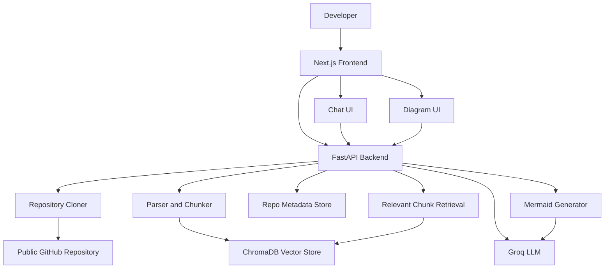

# CodeAtlas

CodeAtlas is a repository intelligence tool that turns a public GitHub project
into an explorable local knowledge base. It clones the repository, parses
supported source files into semantic chunks, stores those chunks in ChromaDB,
and exposes a chat and diagramming experience through a Next.js frontend.

The project is organized as a FastAPI backend plus a Next.js frontend. The
backend handles cloning, parsing, chunking, retrieval, chat, diagram
generation, and persistence. The frontend provides the landing page, analysis
submission flow, repository dashboard, code explorer, chat UI, and Mermaid
diagram viewer.

## What CodeAtlas Does

1. Accepts a public GitHub repository URL.
2. Validates the URL and checks repository metadata through the GitHub API.
3. Clones the repository locally with a shallow `git clone`.
4. Parses supported files into structured chunks.
5. Stores chunks in a persistent ChromaDB collection.
6. Persists repository metadata and generated diagrams to disk.
7. Lets you ask code-aware questions with source citations.
8. Generates Mermaid diagrams for class structure, dependencies, flow, and architecture.
9. Lets you browse the analyzed repository through a file tree and language breakdown.

## Core User Features

### Repository analysis

The home page accepts a GitHub repository URL and starts a background analysis
job. While the job runs, the frontend polls the backend until the repository is
ready, then redirects to the repository dashboard.

### Repository dashboard

The dashboard combines three main views:

- Chat: ask questions about the analyzed repository.
- Diagrams: generate and render Mermaid diagrams.
- Explorer: inspect the repository file tree and language distribution.

### AI chat with citations

Chat requests use retrieval-augmented generation. The backend fetches the most
relevant code chunks from ChromaDB, builds a prompt around those chunks, and
calls Groq to produce an answer. The frontend shows the answer with source
references.

### Automatic diagrams

The diagram view can generate these diagram types:

- Class diagram
- Dependency diagram
- Flow diagram
- Architecture diagram

The frontend renders the returned Mermaid code and also lets you copy it.

### Persistent recovery

Repository metadata and generated diagrams are saved to disk so analyzed repos
can be recovered after backend restarts.

## Architecture Overview



## Repository Layout

```text
CodeAtlas/
  README.md
  README2.md
  backend/
    config.py
    dev.py
    main.py
    pyproject.toml
    models/
      schemas.py
    routes/
      chat.py
      diagrams.py
      repo.py
    services/
      chunker.py
      cloner.py
      diagram_generator.py
      parser.py
      rag.py
      repo_store.py
      vector_store.py
    chroma_data/
    cloned_repos/
    repo_metadata/
  frontend/
    app/
      globals.css
      layout.tsx
      page.tsx
      repo/[id]/page.tsx
    package.json
    tsconfig.json
```

## Backend

The backend is a FastAPI application that exposes the repository analysis,
chat, and diagram endpoints.

### Application entry point

[`backend/main.py`](backend/main.py) configures the FastAPI app, CORS, logging,
and the route routers. It also exposes the root health endpoint and a detailed
`/health` endpoint.

### Configuration

[`backend/config.py`](backend/config.py) loads settings from environment
variables or `backend/.env`.

Important settings:

- `GROQ_API_KEY`: required for chat and diagram generation.
- `GROQ_MODEL`: defaults to `llama-3.3-70b-versatile`.
- `CHROMA_PERSIST_DIR`: defaults to `./chroma_data`.
- `CLONE_DIR`: defaults to `./cloned_repos`.
- `REPO_METADATA_DIR`: defaults to `./repo_metadata`.
- `MAX_REPO_SIZE_MB`: defaults to `100`.
- `MAX_FILES`: defaults to `5000`.
- `MAX_CHUNK_CHARS`: defaults to `1500`.
- `CHUNK_OVERLAP`: defaults to `200`.
- `TOP_K`: defaults to `10`.
- `CORS_ORIGINS`: defaults to the local frontend origins.

### Data models

[`backend/models/schemas.py`](backend/models/schemas.py) defines:

- `AnalysisStatus`: queued, cloning, parsing, embedding, generating_diagrams, ready, error.
- `DiagramType`: class, dependency, flow, architecture.
- `ChunkType`: class, function, method, import, module, text.
- `RepoAnalyzeRequest`
- `ChatRequest`
- `DiagramGenerateRequest`
- `CodeChunk`
- `FileTreeNode`
- `LanguageStat`
- `RepoInfo`
- `RepoStatusResponse`
- `SourceCitation`
- `ChatResponse`
- `Diagram`

## Backend Services

### Repository cloning

[`backend/services/cloner.py`](backend/services/cloner.py) validates GitHub URLs,
queries the GitHub API for metadata, enforces repository size limits, clones
public repositories with `git clone --depth 1`, and cleans up cloned data.

What it does:

- Accepts only public GitHub repository URLs matching the expected pattern.
- Uses the GitHub REST API to check existence and approximate size.
- Allows analysis to continue if GitHub metadata requests are rate-limited or unavailable.
- Rejects repositories larger than the configured limit.
- Removes cloned data on failure or on delete.

### Parsing and chunking

[`backend/services/parser.py`](backend/services/parser.py) and
[`backend/services/chunker.py`](backend/services/chunker.py) are responsible for
turning files into searchable structured content.

Supported parsing behavior:

- Python uses the built-in `ast` module.
- JavaScript and TypeScript use regex-based structure extraction.
- Java, Go, Rust, C, and C++ use regex-based structure extraction.
- Markdown, YAML, JSON, TOML, XML, HTML, CSS, SCSS, and SQL are stored as text chunks.
- Unknown or unsupported text files fall back to text chunking when reached.

Chunking behavior:

- Files are walked recursively.
- Skips common build, cache, dependency, and VCS directories.
- Skips binary files and known lockfiles.
- Skips very large files over 500 KB during parsing.
- Enforces the configured repository file limit.
- Builds a recursive file tree for the frontend explorer.
- Computes per-language file and chunk counts.

### Vector store

[`backend/services/vector_store.py`](backend/services/vector_store.py) wraps
ChromaDB and stores one collection per repository.

Capabilities:

- Creates or replaces per-repository collections.
- Stores chunk text and metadata.
- Queries semantically similar chunks for chat retrieval.
- Filters retrieval by chunk type and language when needed.
- Exposes basic collection information for recovery.

### RAG pipeline

[`backend/services/rag.py`](backend/services/rag.py) handles code-aware chat.

Behavior:

- Retrieves the most relevant chunks from ChromaDB.
- Builds a prompt that includes the retrieved source context.
- Sends the prompt to Groq using the configured model.
- Returns a final answer plus source citations.
- Supports both full JSON responses and SSE streaming responses.

### Diagram generation

[`backend/services/diagram_generator.py`](backend/services/diagram_generator.py)
builds Mermaid diagrams from repository chunks.

Diagram generation behavior:

- Class diagrams are built from class and type chunks.
- Dependency diagrams are built from import chunks.
- Flow diagrams are built from function and method chunks.
- Architecture diagrams combine a broader sample of repository chunks.
- LLM output is cleaned to remove code fences and invalid unicode/emoji.
- A fallback Mermaid diagram is returned if generation fails.

### Metadata persistence

[`backend/services/repo_store.py`](backend/services/repo_store.py) persists
analyzed repository metadata and generated diagrams under `repo_metadata/`.

Stored artifacts:

- `info.json` for repository metadata.
- `diagrams.json` for generated Mermaid diagrams.

This allows the dashboard to recover after a backend restart, even if the
in-memory repository state is gone.

## Backend API

### Health

| Method | Route | Purpose |
| --- | --- | --- |
| `GET` | `/` | Basic service status |
| `GET` | `/health` | Health check and Groq configuration state |

### Repository analysis

| Method | Route | Purpose |
| --- | --- | --- |
| `POST` | `/api/repo/analyze` | Start analysis of a public GitHub repository |
| `GET` | `/api/repo/{repo_id}/status` | Get the current analysis status |
| `GET` | `/api/repo/{repo_id}/info` | Get full repository metadata after analysis completes |
| `DELETE` | `/api/repo/{repo_id}` | Delete cloned data, vector store data, and persisted metadata |

### Chat

| Method | Route | Purpose |
| --- | --- | --- |
| `POST` | `/api/chat/{repo_id}` | Stream an answer over SSE |
| `POST` | `/api/chat/{repo_id}/sync` | Return a full JSON answer |

Streaming events emitted by the SSE endpoint:

- `citations`: source references first
- `token`: incremental answer text
- `error`: error message if generation fails
- `done`: completion signal

### Diagrams

| Method | Route | Purpose |
| --- | --- | --- |
| `POST` | `/api/diagrams/{repo_id}/generate` | Generate one or more diagram types |
| `GET` | `/api/diagrams/{repo_id}` | Read cached diagrams |

## Frontend

The frontend is a Next.js app that provides the user experience around the API.

### Home page

[`frontend/app/page.tsx`](frontend/app/page.tsx) is the landing page. It:

- Prompts for a public GitHub repository URL.
- Shows example repositories.
- Explains the main product features.
- Posts the repository URL to the backend.
- Polls analysis status until the repository is ready.
- Redirects to the repository dashboard.

### Repository dashboard

[`frontend/app/repo/[id]/page.tsx`](frontend/app/repo/[id]/page.tsx) renders the
analyzed repository dashboard.

Tabs and behavior:

- Chat: sends questions to the streaming chat endpoint and displays citations.
- Diagrams: loads cached diagrams or generates new ones, then renders Mermaid.
- Explorer: shows the recursive file tree and language statistics.

### Frontend rendering details

The dashboard also includes:

- Markdown rendering for assistant responses.
- Syntax-highlighted code blocks.
- Copy buttons for code blocks and Mermaid output.
- Responsive, animated UI states for loading, errors, and empty views.
- Mermaid rendering in the browser.

## Supported Repository Analysis Features

### File and language handling

The parser recognizes these extensions and language families:

- Python: `.py`
- JavaScript: `.js`, `.jsx`
- TypeScript: `.ts`, `.tsx`
- Java: `.java`
- Go: `.go`
- Rust: `.rs`
- C: `.c`, `.h`
- C++: `.cpp`, `.cxx`, `.cc`, `.hpp`
- C#: `.cs`
- Ruby: `.rb`
- PHP: `.php`
- Swift: `.swift`
- Kotlin: `.kt`
- Scala: `.scala`
- R: `.r`, `.R`
- Lua: `.lua`
- Shell: `.sh`, `.bash`, `.zsh`
- SQL: `.sql`
- Markdown: `.md`
- YAML: `.yaml`, `.yml`
- JSON: `.json`
- TOML: `.toml`
- XML: `.xml`
- HTML: `.html`
- CSS: `.css`
- SCSS: `.scss`

### Skipped content

The analyzer skips common generated or irrelevant content such as:

- `.git`, `.svn`, `.hg`
- `node_modules`
- Python virtual environments
- build and output directories like `dist`, `build`, `.next`, `target`, `bin`, `obj`
- IDE metadata like `.idea`, `.vscode`, `.vs`
- cache and coverage directories
- binary files and large generated assets

## Runtime Storage

CodeAtlas stores runtime data locally inside the backend workspace:

- `backend/cloned_repos/`: shallow clones of analyzed repositories.
- `backend/chroma_data/`: persistent ChromaDB data.
- `backend/repo_metadata/`: saved repository metadata and diagrams.

These directories are meant for runtime data and should not be treated as source
code.

## Setup

### Backend requirements

- Python 3.13 or newer.
- Git installed and available on `PATH`.
- A valid Groq API key.

### Frontend requirements

- Node.js installed.
- npm available.

### Backend setup

```powershell
cd backend
copy .env.example .env
```

Set at minimum:

```env
GROQ_API_KEY=your_groq_api_key_here
```

Run the backend:

```powershell
uv run dev
```

The backend listens on `http://localhost:8000`.

### Frontend setup

```powershell
cd frontend
npm install
npm run dev
```

The frontend listens on `http://localhost:3000`.

If the backend is not on the default location, set:

```env
NEXT_PUBLIC_API_URL=http://localhost:8000
```

## Development Commands

Backend:

```powershell
cd backend
uv run dev
uv run python -m compileall config.py dev.py main.py models routes services
```

Frontend:

```powershell
cd frontend
npm run lint
npm run build
npm run dev
```

## Development Notes

- Use `uv run dev` for backend development rather than `fastapi dev main:app`.
- The development server excludes generated folders from reload watching.
- The repository analysis state is cached in memory and recovered from disk when possible.
- No automated test suite is present in the repository snapshot.

## Example Workflow

1. Start the backend and frontend.
2. Open the home page in the browser.
3. Paste a public GitHub repository URL such as `https://github.com/fastapi/fastapi`.
4. Wait for cloning, parsing, and embedding to finish.
5. Open the dashboard.
6. Ask a question about the repository or generate diagrams.
7. Browse the file tree and language breakdown in the explorer tab.

## Limitations

- Only public GitHub repositories are supported.
- Repository size is capped by configuration.
- The analyzer focuses on supported source and text files; binary and large generated files are skipped.
- Diagram quality depends on the LLM output and may need regeneration.
- Chat responses are constrained by retrieved context and model limits.

## Troubleshooting

- If analysis fails immediately, check `GROQ_API_KEY` and verify Git is installed.
- If repository validation fails, make sure the URL is a public GitHub repo URL.
- If the dashboard cannot load, confirm the repo is ready and the backend is still running.
- If diagrams do not render, copy the raw Mermaid code and inspect it for syntax issues.
